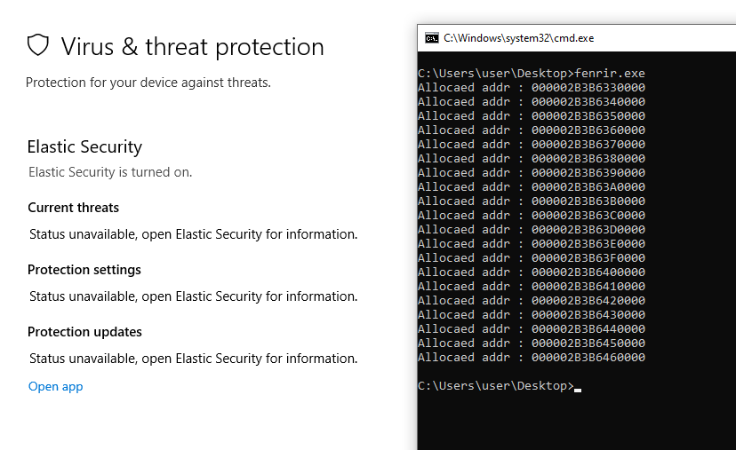

# Fenrir

This is a C++ code designed to easily perform stack spoofing with a fake stack frame after the gadget. This project is based on `LoudSunRun`, but instead of using the `jmp RBX` gadget, it utilizes `jmp RDI`. With this approach, Elastic XDR does not detect the spoofing.

Nowadays, some EDRs have stopped hooking Nt functions in ntdll.dll due to the ease of evading such hooks, as demonstrated by solutions like Elastic XDR.

https://www.elastic.co/security-labs/doubling-down-etw-callstacks

# How to use 

You need to use the spoof class and specify both the fake frame and the module name for the gadget in the constructor.

For the gadget, you specify the module name, and the code searches for all `jmp RDI` gadgets within the .text section. Once all gadgets are found, one is randomly selected.

```
	spoof test({
    { "kernel32.dll", "BaseThreadInitThunk", 0x14 },    // fake second frame
    { "ntdll.dll", "RtlUserThreadStart", 0x21 }         // fake third frame
    },
	"ntdll.dll");                                       // module name for "jmp RDI" gadget

	test.call("Kernel32.dll", "WaitForSingleObject", { (HANDLE)-1, (void*)0x1000 });

	return EXIT_SUCCESS;
```

# Stackframe

- Stack frame view 


- Gadget frame view 


- Elastic XDR view with "jmp RDI"




# List of "jmp [RDI]" gadget inside module

Check ed on Windows11 24h2 

- Kernel32.dll : 0
- Kerlebase.dll : 2
- User32.dll : 1

# Feature update

- Expand the fake stackframe limit
- Add polymorphism

# Credit

- https://github.com/susMdT/LoudSunRun

- https://github.com/WithSecureLabs/CallStackSpoofer


